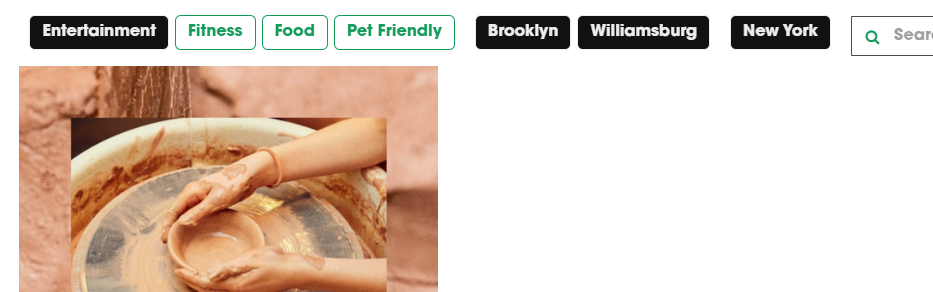
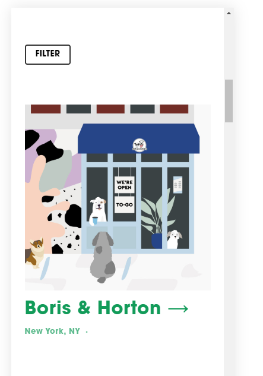
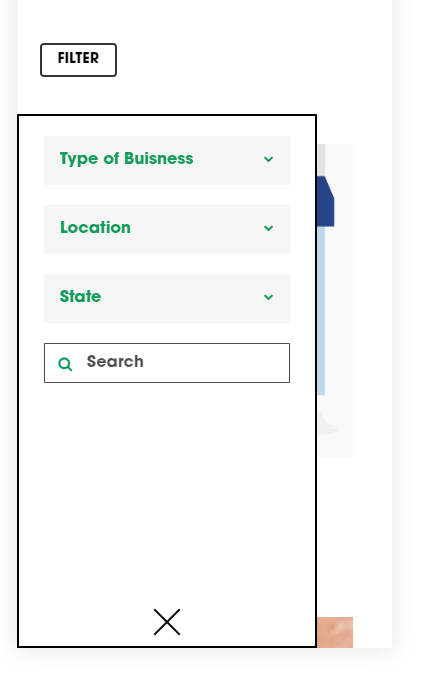

## Structure

Each buisness should have one or more _categories_, one or more location _tags_ and one state _tag_.

As long as we have 3 or more things to filter (Buisness Type, Location and State for now) any tag or category not included in the filter script won't be filtered. If there were only two it would work automatically when you added a new tag or category in the squarespace wysiwyg editor. It's annoying, but I couldn't find a reasonable fix.
 

_Currently available_:

Type of buisness (category): `"Entertainment, Fitness, Food, Health, Pet Friendly"`

Location (tag): `"Brooklyn, Manhattan, Queens, Bronx, Staten Island, Williamsburg, SoHo, Upper West Side, Upper East Side, Harlem, West Village, Lower East Side"`

State (tag): `"New York, New Jersey"`

## View

There are a few predesigned styles for the filters UI that might be appropriate: dropdown, modern, buttons, inline buttons, and round buttons. These could be tweaked with custom css if needed.

#### dropdown:

modern

buttons

buttons inline

buttons round

## Layout

The UI could easily be moved to the left side of the screen for tablet/desktops, but it would create empty space below it.

## Mobile

The default is a "Filter" button on the landing page which brings up a mostly full screen UI for the filters.

